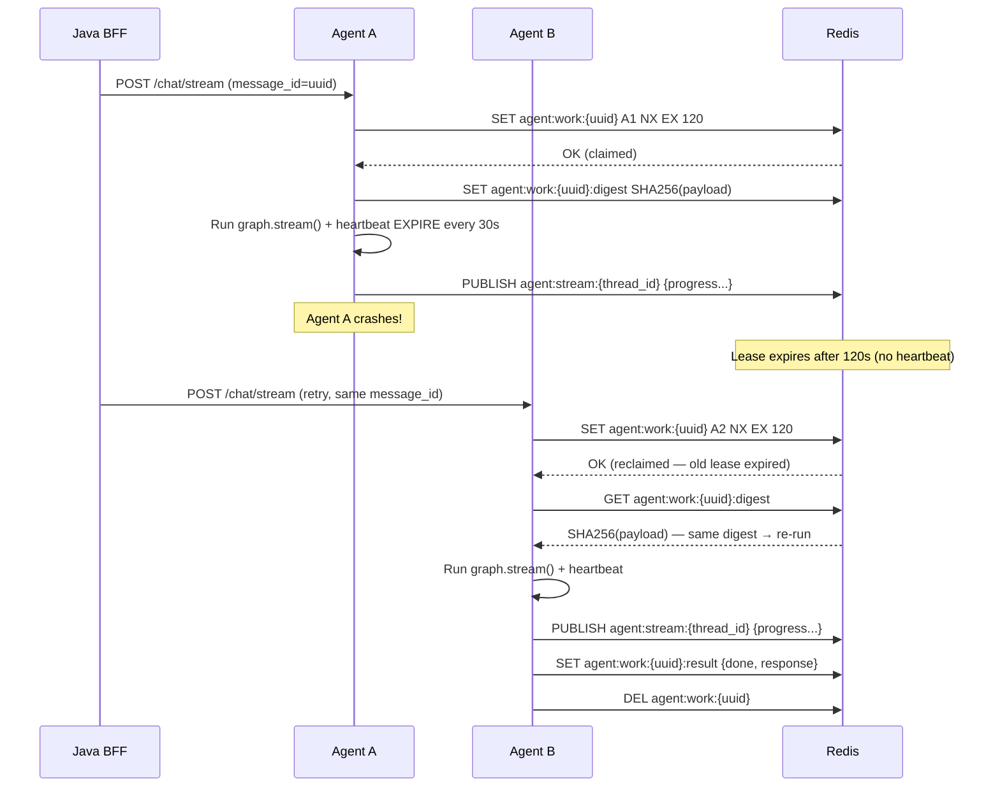
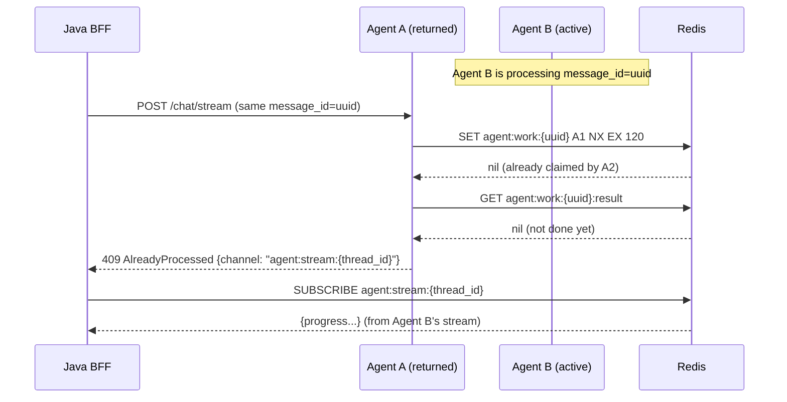
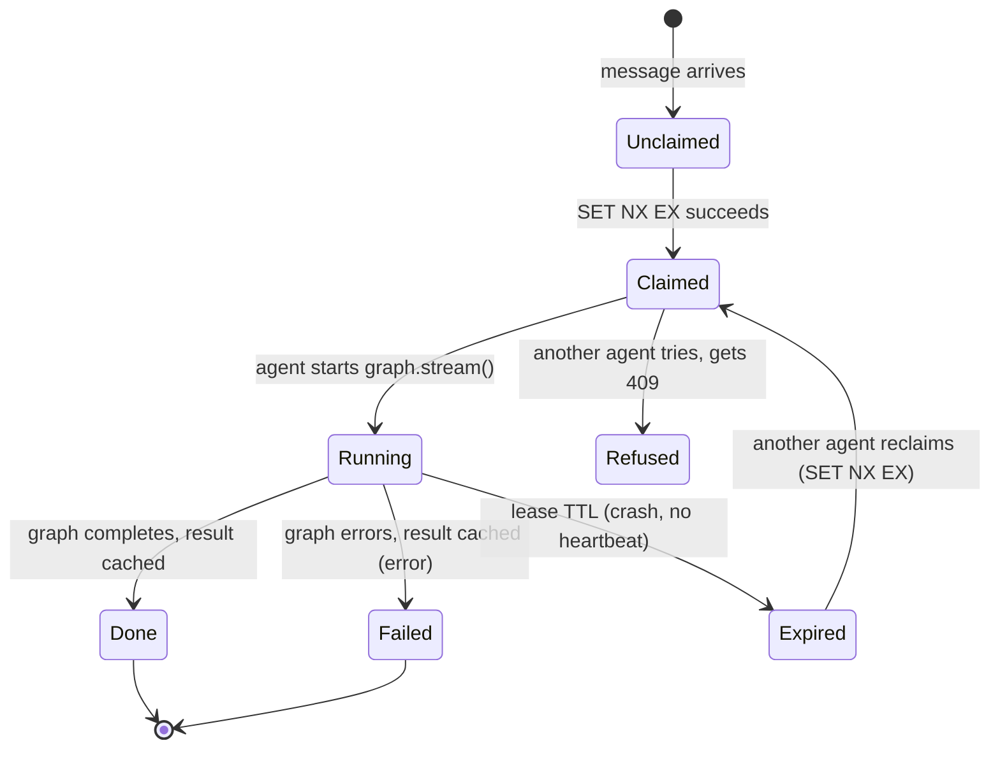

# ADR-001: Agent Failover with Redis Work-Claim, Lease, and Dedup

## Context

The Statistiloto agent (`agent/app/main.py`) is a Python LangGraph worker that
processes chat requests via `POST /chat/stream`. When Redis is available, the
agent publishes progress events to channel `agent:stream:{thread_id}` and sets
a status key `agent:stream:{thread_id}:status` (1h TTL). The Java BFF
(`AgentClientService`) proxies requests to the agent and subscribes to the Redis
channel to relay SSE events to the UI.

**Current limitations:**
- No work-claiming: if two agent replicas run, both could process the same request.
- No dedup: a retried request (e.g. after network blip) re-runs the full LLM pipeline.
- No failover: a crashed agent's in-flight work is silently lost — no takeover.
- No refusal: when a crashed agent comes back, it has no way to know its previous
  work was already taken over by another agent.

## Decision

Adopt an **idempotent work-claim with lease + dedup** pattern using Redis.

### Key schema

| Key | Type | TTL | Purpose |
|-----|------|-----|---------|
| `agent:work:{message_id}` | String (owner instance_id) | lease_ttl (e.g. 120s) | Atomic claim via `SET NX EX` |
| `agent:work:{message_id}:result` | String (JSON result) | 24h | Cached final result for dedup |
| `agent:work:{message_id}:digest` | String (SHA256(payload)) | same as work key | Payload fingerprint for crash-vs-new detection |
| `agent:stream:{thread_id}:status` | String ("active") | 1h | Existing — stream liveness (unchanged) |

**Key distinction:** `thread_id` = `{sub}:{session_id}` (a conversation).
`message_id` = per-message UUID (a single turn). Dedup is per-message, not
per-thread — a new message on the same session must NOT be rejected.

### Claim flow

1. Agent receives `/chat/stream` request, generates `message_id` (UUID).
2. `SET agent:work:{message_id} <instance_id> NX EX <lease_ttl>` — atomic claim.
   - If `NX` succeeds → this agent owns the work → proceed.
   - If `NX` fails → another agent owns it → check result cache (below).
3. Store `agent:work:{message_id}:digest` = `SHA256(payload)` for crash detection.

### Lease renewal

The owning agent heartbeats `EXPIRE agent:work:{message_id} <lease_ttl>` every
N seconds (e.g. every 30s) while the graph is running. On crash, the lease
expires → another agent can reclaim.

### Dedup on reprocess

Before processing, check `agent:work:{message_id}:result`:
- If present → return the cached result (idempotent resume — no re-run).
- If absent but `agent:work:{message_id}` exists (claimed by another) → return
  `409 AlreadyProcessed` with the channel name so the BFF can subscribe to the
  existing stream.
- If absent and `agent:work:{message_id}` expired → reclaim via `SET NX EX` and
  re-run (the previous owner crashed).

### Crash-vs-new detection

On reclaim, compare `SHA256(current_payload)` with `agent:work:{message_id}:digest`:
- Same digest → same work, previous crash → re-run (idempotent).
- Different digest → different work, same message_id (should not happen with UUIDs
  but defensive) → log warning, treat as new work.

### Refusal on comeback

When agent A returns after crash and tries to process a message whose
`agent:work:{message_id}` is `claimed`/`running` by agent B:
- Agent A returns `409 AlreadyProcessed` with `{channel, owner}`.
- The BFF subscribes to the existing `agent:stream:{thread_id}` channel and
  relays events to the UI — the user sees no interruption.

## Failure and recovery model

| Failure | Detection | Recovery |
|---------|-----------|----------|
| Agent crash mid-processing | Lease expires (no heartbeat) | Another agent reclaims via `SET NX EX`, re-runs |
| Network blip (BFF→agent) | BFF retry | Dedup via result cache — no re-run |
| Redis unavailable | `is_redis_available()` returns false | Fall back to inline SSE (existing behavior) |
| Two agents race for same message | `SET NX` — only one wins | Loser gets 409, subscribes to winner's stream |

## Compatibility/rollout

- Backward compatible: when Redis is unavailable, existing inline SSE path is
  unchanged. The work-claim layer is additive — it only activates when Redis is
  present.
- Rollout: deploy agent changes first (no-op when single instance), then scale
  to multiple replicas. The BFF needs a minor change to handle 409
  `AlreadyProcessed` by subscribing to the existing channel.

## Mermaid

### Sequence: claim, process, reclaim

### Sequence: refusal (agent comes back)

### State: work item lifecycle

## Consequences

- **Positive:** Multi-agent horizontal scaling with no duplicate work; automatic
  failover on crash; idempotent retries; no data loss.
- **Negative:** Adds Redis dependency for multi-agent mode (mitigated by inline
  SSE fallback for single-agent). Adds ~1ms per request for claim SET. Requires
  BFF to handle 409 AlreadyProcessed.
- **Neutral:** `message_id` generation adds a UUID per request (negligible cost).

## Implementation order

1. Add `message_id` (UUID) generation to `/chat/stream` request flow.
2. Implement claim/lease/dedup helpers in `redis_client.py`.
3. Wire claim into `_run_redis_stream()` in `main.py`.
4. Cache result on done/error; clear work key on completion.
5. Update BFF `AgentClientService` to handle 409 by subscribing to existing channel.
6. Add integration tests for claim/reclaim/refusal scenarios.

## Next skill

`solution-planner`
