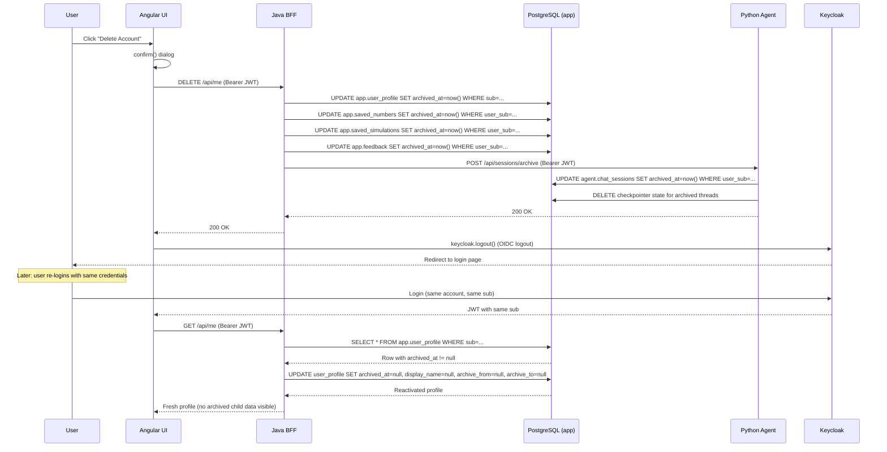
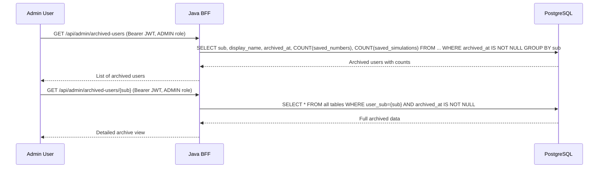

# ADR-002: Account Soft-Archive on Deletion with Re-registration Support

## Context

The profile page (`profile.component.ts`) currently has a `deleteAccount()`
method that redirects users to the Keycloak account console — exposing Keycloak
UI to non-admin users. The user wants:

1. Clicking "delete account" should log the user out and archive their DB
   records (not hard-delete).
2. Admin can fetch archived user data for audit.
3. The same user can create a new account (or re-login) and get a fresh record
   without the archived state.

**Current schema (verified):**
- `app.user_profile`: PK = `sub` (TEXT). Columns: sub, display_name, archive_from,
  archive_to, created_at.
- `app.saved_numbers`: `user_sub` FK → `user_profile(sub)` ON DELETE CASCADE.
- `app.saved_simulations`: `user_sub` FK → `user_profile(sub)` ON DELETE CASCADE.
- `app.feedback`: `user_sub` (indexed, no FK constraint).
- `agent.chat_sessions`: `user_sub TEXT NOT NULL`, `UNIQUE(user_sub, session_id)`.
- `agent.token_usage`: `user_sub TEXT NOT NULL` (operational log).
- `agent.audit_log`: `user_sub` (operational log).
- `ensureProfile()`: `findById(sub).orElseGet(() -> create new)`.

## Decision

**Archive in place, reactivate on re-login.**

Add an `archived_at TIMESTAMPTZ DEFAULT NULL` column to all user-owned tables.
On account deletion, set `archived_at = now()` on all rows. On re-login,
`ensureProfile` reactivates the profile with fresh defaults; old child records
stay archived and invisible to active queries.

### Why not hard-delete?

- Admin auditability: archived data is admin-auditable (GDPR compliance).
- No PK conflict on re-registration: `user_profile.sub` is PK — hard-deleting
  and re-creating would work, but we'd lose audit history.
- FK safety: soft-delete (setting `archived_at`) doesn't trigger
  `ON DELETE CASCADE`, preserving child records.

### Why not separate archive tables?

- More complex: requires copy-then-delete logic, dual schema management.
- The `archived_at` column approach is simpler, atomic (single UPDATE), and
  query filtering via `WHERE archived_at IS NULL` is cheap with an index.

## Components/contracts affected

| Component | Change |
|-----------|--------|
| `server` Flyway V5 | Add `archived_at` to app.user_profile, saved_numbers, saved_simulations, feedback |
| `server` UserController | New `DELETE /api/me` endpoint — archives all user data |
| `server` UserProfileService | `ensureProfile` reactivation logic; `archiveUser` method |
| `server` SavedNumbersService | Query filter `archived_at IS NULL` |
| `server` SavedSimulationService | Query filter `archived_at IS NULL` |
| `server` FeedbackService | Query filter `archived_at IS NULL` |
| `server` AdminArchiveController | New: `GET /api/admin/archived-users`, `GET /api/admin/archived-users/{sub}` |
| `agent` db/init-agent.sql | Add `archived_at` to chat_sessions |
| `agent` sessions.py | Query filter `archived_at IS NULL` |
| `agent` main.py | New `POST /api/sessions/archive` endpoint |
| `ui-fable` profile.component.ts | `deleteAccount()` calls `DELETE /api/me` then `auth.logout()` |

## Failure and recovery model

| Failure | Recovery |
|---------|----------|
| `DELETE /api/me` partial failure (app archived, agent not) | Idempotent: re-calling sets `archived_at` again (no-op if already set). Agent archive is best-effort — app archive is the source of truth. |
| User re-login before archive completes | `ensureProfile` checks `archived_at` — if set, reactivates. If archive is in-flight, the profile is already archived (single UPDATE). |
| Agent unavailable during archive | App-side archive succeeds; agent sessions remain active but are orphaned (no user profile). Admin can manually trigger agent archive later. |

## Compatibility/rollout

- **Backward compatible:** `archived_at` defaults to NULL — existing rows are
  treated as active. No data migration needed.
- **Rollout:** Deploy Flyway V5 first, then server changes, then agent changes,
  then UI changes. Each layer is independently deployable.
- **Keycloak account:** NOT deleted. User can re-login with same credentials
  (fresh profile) or register a new account (new sub → new profile).

## Mermaid

### Sequence: delete → archive → re-login → reactivate

### Admin audit flow

## ADR

- **Context:** Account deletion must archive data (admin-auditable) while
  allowing re-registration with fresh state. Schema uses `sub` as PK with
  CASCADE FKs.
- **Decision:** Soft-archive via `archived_at` column on all user-owned tables.
  `DELETE /api/me` sets `archived_at`. `ensureProfile` reactivates on re-login.
  Active queries filter `archived_at IS NULL`. Admin bypasses filter.
- **Consequences:**
  - Positive: No data loss, admin-auditable, clean re-registration, no PK
    conflicts, no CASCADE triggers.
  - Negative: Slightly more complex queries (WHERE filter). Storage grows with
    archived data (mitigated by admin purge capability if needed later).
  - Neutral: Keycloak account is not deleted — user can re-login or register
    new account.

## Implementation order

1. Flyway V5 migration: add `archived_at` to app schema tables.
2. Update `agent/db/init-agent.sql`: add `archived_at` to chat_sessions.
3. JPA entities: add `archived_at` field + `@Where(clause = "archived_at IS NULL")`.
4. `UserProfileService.archiveUser()` + `ensureProfile` reactivation.
5. `DELETE /api/me` endpoint in `UserController`.
6. `AdminArchiveController` with admin audit endpoints.
7. Agent `POST /api/sessions/archive` endpoint + session query filters.
8. UI `deleteAccount()` calls `DELETE /api/me` then `auth.logout()`.

## Next skill

`solution-planner`
