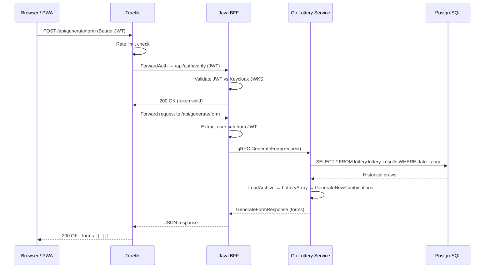
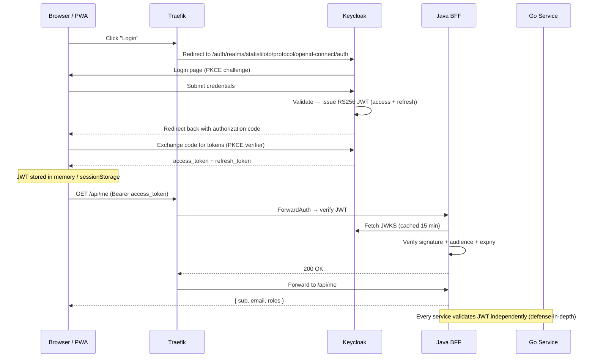
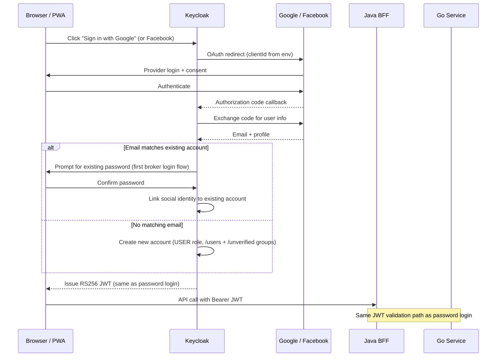
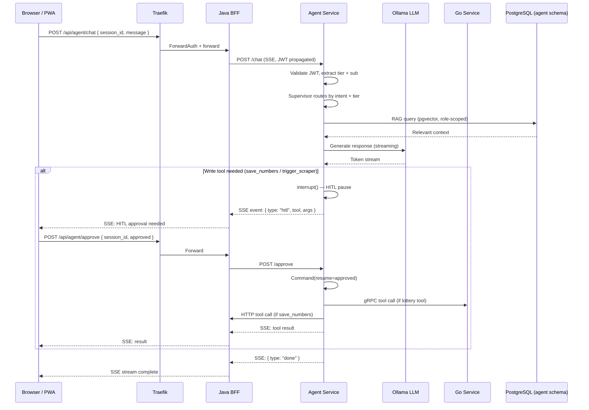
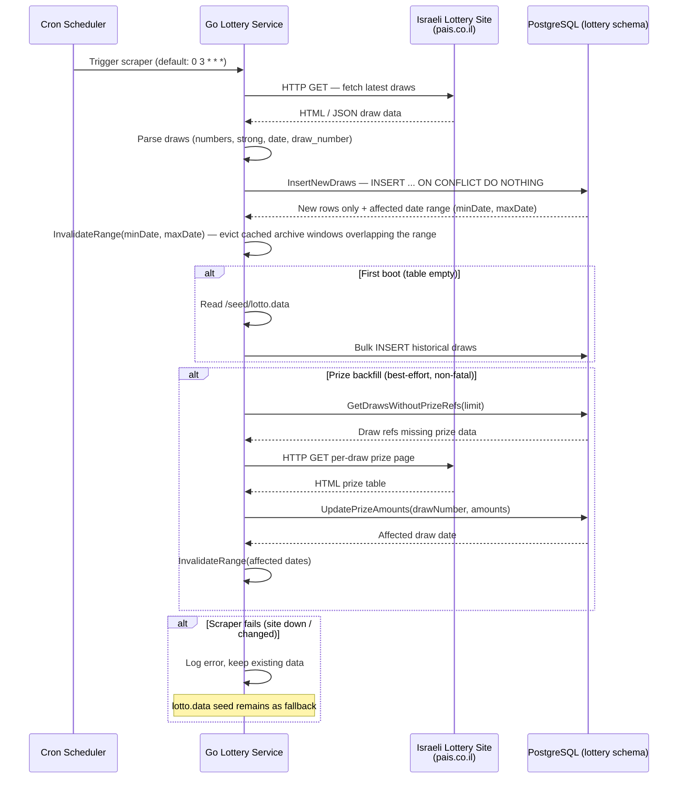
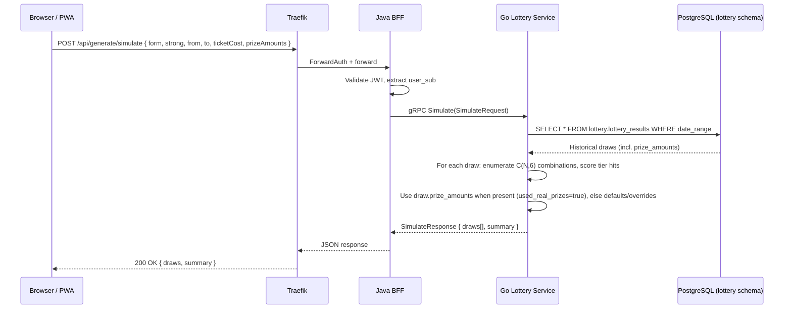
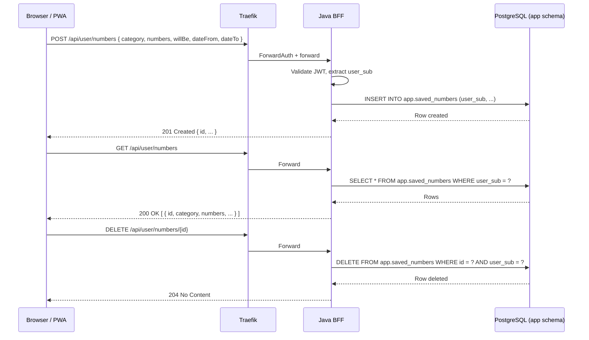

# Statistiloto — Flow Documentation

Mermaid diagrams for the main user flows from the orchestrator perspective.

---

## 1. Full Request Flow (Generate Form)



---

## 2. Authentication Flow



---

## 2a. Social Login Flow (Google / Facebook)

Optional identity providers configured in the Keycloak realm. Credentials are
injected via `.env` (`GOOGLE_CLIENT_ID/SECRET`, `FACEBOOK_CLIENT_ID/SECRET`).
If the env vars are empty, the provider buttons appear on the login page but
produce an error when clicked. Both providers use `trustEmail: false` and the
built-in `first broker login` flow.



---

## 3. Agent Chat Flow



---

## 4. Service Startup & Dependency Flow

```mermaid
flowchart TD
    DB[(PostgreSQL<br/>pgvector:pg16)]
    AUTH[Keycloak 25]
    LOTTERY[Go Lottery Service]
    AGENT[Python Agent]
    OLLAMA[Ollama LLM]
    SERVER[Java BFF]
    UI[Angular PWA]
    PROXY[Traefik]

    DB -->|healthy| AUTH
    DB -->|healthy| LOTTERY
    DB -->|healthy| AGENT
    AUTH -->|healthy| SERVER
    LOTTERY -->|healthy| SERVER
    AGENT -->|healthy| SERVER
    OLLAMA -.->|runtime only (no startup dep)| AGENT

    AUTH --> PROXY
    SERVER --> PROXY
    AGENT --> PROXY
    UI --> PROXY

    style DB fill:#336791,color:#fff
    style AUTH fill:#e87431,color:#fff
    style PROXY fill:#24a1c1,color:#fff
```

Startup ordering enforced by Compose `depends_on` with `condition: service_healthy`:
1. **db** — PostgreSQL starts first, runs init scripts (schemas + grants)
2. **auth** — Keycloak waits for db healthy, imports realm
3. **lottery** — Go service waits for db healthy, runs Liquibase, starts scraper schedule
4. **agent** — Python agent waits for db, auth, and lottery healthy
5. **ollama** — Independent; no `depends_on`. The agent calls it at runtime
   (LLM inference), so it must be up before the first chat request, but Compose
   does not gate agent startup on it.
6. **server** — Java BFF waits for db, auth, lottery, and agent all healthy
7. **ui** — Independent (static files)
8. **proxy** — Traefik starts last, depends on auth, server, agent, ui

---

## 5. Scraper Flow (Data Freshness)



---

## 6. Simulate (Backtest) Flow



> For systematic forms (8/10/12 numbers), every C(N,6) combination is played per
> draw, so a single draw can hit multiple prize tiers. `summary.drawsWithRealPrizes`
> counts draws priced from scraped per-draw data vs. defaults/overrides.

---

## 7. Saved Numbers CRUD Flow


