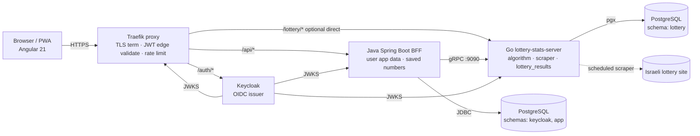
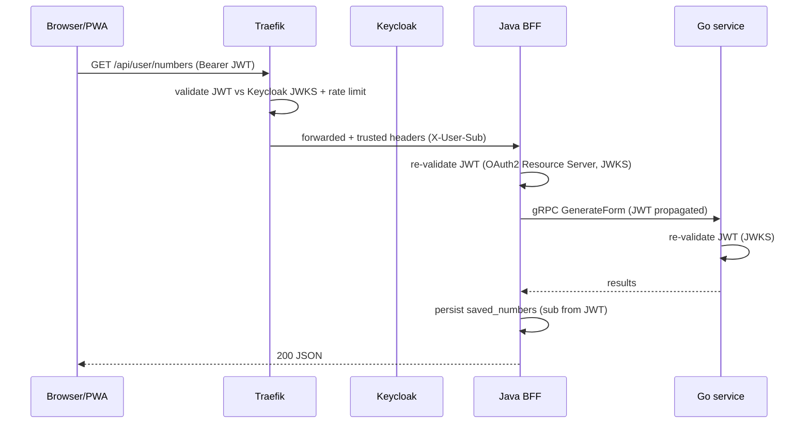

# Statistiloto-New — Scalable, Stateless, Secured Architecture

Rebuild the Statistiloto Israeli-lottery analysis product as a containerized microservices system: an Angular 21 PWA UI, a Java Spring Boot BFF, a Go lottery-algorithm service (reused from `stat-tree-server`), Keycloak auth, a Traefik edge proxy with rate limiting, and PostgreSQL — all stateless, horizontally scalable, and secured with OAuth2/OIDC JWTs validated both at the edge and inside each service.

---

## Product intent & goals (carried over from the original POC)

Statistiloto helps users analyze the Israeli lottery by:

1. **Generating** lottery number combinations from historical-draw patterns.
2. **Calculating statistics** — frequent number pairs/groups over a date range.
3. **Analyzing** user-selected numbers against historical winning draws.
4. **Saving & managing** generated/favorite numbers per user account.
5. Providing **web/PWA access** (originally Ionic mobile; now Angular PWA).

Core IP is the tree-based `LotteryArray` analysis engine (pattern detection, frequency analysis, combination generation) — already ported to Go in `stat-tree-server` (`internal/lottery-tree`), which also includes a **scraper** to fetch fresh draws and a **seeder**.

---

## Architecture



Notes:

- One PostgreSQL container, **three logical schemas**: `keycloak` (managed by Keycloak), `app` (Java BFF: user profiles, saved numbers), `lottery` (Go: `lottery_results`). Clean ownership, no shared tables.
- Java↔Go over **gRPC** with a **shared `/proto` contract** at repo root; both services generate stubs from it.
- Go service exposes its REST gateway too (kept from `stat-tree-server`) for direct debugging/admin, but the UI only talks to the Java BFF (BFF pattern) through Traefik.

---

## Services & folder layout (`statistiloto-new/`)

```text
statistiloto-new/
├── docker-compose.yml            # orchestrates all 6 services + networks/volumes
├── .env.example                  # all config (DB creds, Keycloak, JWT, ports)
├── proto/                        # shared protobuf contract (lottery.proto) — single source of truth
│   └── lottery.proto
├── ui/                           # Angular 21 PWA  (containerized via multi-stage Dockerfile)
├── server/                       # Java Spring Boot BFF (containerized)
├── lottery-stats-server/         # Go service — git submodule → github.com/lihai1/stat-tree-server (adapted)
├── auth/                         # Keycloak: realm import JSON, Dockerfile tweaks if any
├── proxy/                        # Traefik: traefik.yml, dynamic config, rate-limit rules, TLS
├── db/                           # Postgres init scripts (create schemas), seed mount
└── docs/                         # ARCHITECTURE.md, API.md, runbook
```

### 1. `ui/` — Angular 21 PWA (new)

- **Starter**: `ng new ui --standalone --routing --style=scss --strict` (Angular 21, standalone, zoneless, signals, esbuild).
- **Stack**: Angular Material 3 + Tailwind v4, `@jsverse/transloco` (i18n — preserve Hebrew UI), `keycloak-js` (OIDC authorization-code + PKCE), Angular `HttpClient` with a JWT interceptor, signals for state.
- **Tests**: Vitest (Angular 21 default) + Playwright E2E; ESLint + Prettier.
- **PWA**: `ng add @angular/pwa` — service worker, installable, offline shell.
- **Features mapped from original**: generate forms, statistics (pares), analyze, lucky numbers, saved-numbers management, login/register (via Keycloak).
- **Build**: multi-stage Dockerfile (node build → nginx serve static; nginx not the edge proxy, Traefik is).

### 2. `server/` — Java Spring Boot BFF (new)

- **Starter**: Spring Initializr → Spring Boot 3.5.x, Java 21, Gradle (Kotlin DSL) or Maven, dependencies: web, security, oauth2-resource-server, data-jpa, validation, actuator, flyway, postgresql, grpc-stubs, openapi.
- **Role**: BFF for the UI. Owns user app data (saved numbers/forms, preferences). Calls Go via gRPC for all algorithm work. Validates Keycloak JWTs itself (Spring Security OAuth2 Resource Server, JWKS from Keycloak) — defense in depth.
- **Package layout** (clean, record-based DTOs):
  `config/ · controller/ · dto/{request,response} · entity/ · repository/ · service/ · security/ · grpc/client/ · exception/`

- **DB schema `app`** (Flyway): `user_profile` (id=Keycloak sub, display name), `saved_numbers` (id, user_sub, category, numbers jsonb, will_be jsonb, date_range, created_at). No passwords — Keycloak owns identity.
- **Endpoints** (REST, behind Traefik `/api/*`): `POST /api/generate/form`, `POST /api/generate/statistics`, `POST /api/generate/analyze` (proxy to Go via gRPC and persist results on behalf of user), `GET/POST/DELETE /api/user/numbers` (CRUD saved numbers), `GET /api/me`.
- **gRPC client** to Go generated from `proto/lottery.proto`.

### 3. `lottery-stats-server/` — Go algorithm service (reused)

- **Source**: git submodule of `github.com/lihai1/stat-tree-server` (continue dev there). Take its good practices (Makefile, REST+gRPC, Ginkgo integration tests, Liquibase) as conventions for the other services.
- **Adaptations** (the "adapt" part):
  - **Drop its own JWT auth + `users`/`saved_forms` tables** — identity moves to Keycloak; user app data moves to the Java BFF. Go becomes **stateless compute + `lottery_results` storage**.
  - Validate Keycloak JWTs per-service (JWKS) as extra security, but no user management.
  - Keep: `internal/lottery-tree` (the algorithm), `internal/scraper`, `internal/seeder`, gRPC + gRPC-Gateway, pgx, Liquibase (now only `lottery_results` table in `lottery` schema).
  - **Scraper**: scheduled job (cron) refreshing `lottery_results` from the Israeli lottery site; also seed from the original `lotto.data` on first boot.
  - Migrations move from its own DB to the shared Postgres `lottery` schema.
- **API** (gRPC primary, REST gateway kept): `GenerateForm`, `GetStatistics`, `Analyze` — unchanged behavior, inputs/outputs per shared proto.

### 4. `auth/` — Keycloak (new container)

- Image: `quay.io/keycloak/keycloak:latest`. Provision a `statistiloto` realm via `KC_IMPORT` / realm-export JSON in `auth/realm-statistiloto.json` (clients: `statistiloto-ui` (public, PKCE), `statistiloto-server` (confidential), roles: `USER`, `ADMIN`).
- Owns users, credentials, refresh tokens, password policies. Stateless (in-memory sessions, sticky not required for short-lived).
- Postgres as its DB (schema `keycloak`).

### 5. `proxy/` — Traefik edge (new container)

- Image: `traefik:v3`. TLS termination, Docker provider (auto-discovery via labels).
- **Edge JWT validation**: Traefik JWT/ForwardAuth middleware validates Keycloak access tokens for `/api/*` and `/lottery/*` before forwarding; rejects early.
- **Rate limiting**: per-IP and per-route token buckets (e.g. auth endpoints strict, generate endpoints moderate) via Traefik `rateLimit` middleware.
- **Routing**: `/auth/*`→keycloak, `/api/*`→server, `/`→ui (static), `/lottery/*`→go (admin/direct, optional).
- Config in `proxy/traefik.yml` + `proxy/dynamic.yml`.

### 6. `db/` — PostgreSQL (container)

- Image: `postgres:16-alpine`. Init script `db/init.sql` creates schemas `keycloak`, `app`, `lottery` and grants. Seed mount for `lotto.data`.
- Volume for persistence; healthcheck.

---

## Auth & token flow (stateless end-to-end)



- Login: UI uses `keycloak-js` authorization-code + PKCE → access token (short TTL) + refresh token.
- Every service validates the JWT independently against Keycloak's JWKS endpoint (no shared secret, fully stateless).
- Traefik adds defense-in-depth + rate limiting at the edge.

---

## Implementation steps (ordered)

1. **Scaffold repo**: create `statistiloto-new/` with the folder layout above, root `docker-compose.yml`, `.env.example`, `docs/ARCHITECTURE.md`.
2. **Shared proto**: write `proto/lottery.proto` (services `GenerateForm`, `GetStatistics`, `Analyze` + messages) — derived from the existing `stat-tree-server/proto/lottery.proto`.
3. **db service**: `db/init.sql` (schemas + grants), seed mount for `lotto.data`, compose service with healthcheck.
4. **auth service**: `auth/realm-statistiloto.json` (realm, clients, roles), Keycloak compose service wired to Postgres `keycloak` schema.
5. **proxy service**: `proxy/traefik.yml` + `proxy/dynamic.yml` (TLS, JWT middleware, rate-limit rules, routing labels).
6. **lottery-stats-server**: add as git submodule; adapt per above (drop user/JWT/saved_forms, keep algorithm+scraper+lottery_results, point Liquibase at `lottery` schema, add Keycloak JWT validation, scheduled scraper).
7. **server (Java BFF)**: Spring Initializr scaffold; Flyway `app` schema; Spring Security OAuth2 Resource Server (Keycloak JWKS); REST controllers; gRPC client to Go (generated from shared proto); saved-numbers CRUD; OpenAPI.
8. **ui (Angular PWA)**: `ng new` with the stack above; Keycloak login; feature modules (generate, statistics, analyze, lucky, saved-numbers); PWA; i18n (Hebrew); tests.
9. **Dockerfiles**: multi-stage for ui (node→nginx), server (gradle→jre), go (existing), keycloak/proxy/db images.
10. **Compose wiring**: networks, depends_on/healthchecks, env injection, volume for db + realm import.
11. **Verification**: bring up stack, run scraper/seed, exercise UI flows, run each service's tests.

---

## Files to create (key ones)

- `statistiloto-new/docker-compose.yml` — 6 services + networks/volumes.
- `statistiloto-new/.env.example` — DB creds, Keycloak, JWT, ports, scraper schedule.
- `statistiloto-new/proto/lottery.proto` — shared gRPC contract.
- `statistiloto-new/db/init.sql` — schemas `keycloak`/`app`/`lottery` + grants; seed mount.
- `statistiloto-new/auth/realm-statistiloto.json` — Keycloak realm/clients/roles.
- `statistiloto-new/proxy/traefik.yml` + `proxy/dynamic.yml` — TLS, JWT, rate-limit, routing.
- `statistiloto-new/lottery-stats-server/` — git submodule (adapted).
- `statistiloto-new/server/*` — Spring Boot BFF (Dockerfile, build.gradle, Flyway migrations, controllers/services/entities, gRPC client, security config).
- `statistiloto-new/ui/*` — Angular 21 PWA (Dockerfile, keycloak config, feature components, interceptors, tests).
- `statistiloto-new/docs/ARCHITECTURE.md`, `docs/API.md`, `docs/runbook.md`.

---

## Verification

- [ ] `docker compose up -d` brings all 6 services healthy (`docker compose ps`).
- [ ] Keycloak reachable at `/auth/`, realm imported, can log in as a test user.
- [ ] Scraper/seeder populates `lottery_results` in `lottery` schema (verify via psql).
- [ ] UI loads, redirects to Keycloak login, obtains JWT, calls `/api/*`.
- [ ] Unauthenticated `/api/*` → 401 at Traefik; rate-limited bursts → 429.
- [ ] `POST /api/generate/form` → Java BFF → Go gRPC → results returned; saved to `app.saved_numbers`.
- [ ] `POST /api/generate/statistics` and `/api/generate/analyze` work end-to-end.
- [ ] Each service's own tests pass: `make test` (Go/Ginkgo), `./gradlew test` (Java), `npm test` + `npx playwright test` (UI).
- [ ] Horizontal scale test: `docker compose up --scale server=2 --scale lottery-stats-server=2` still works (stateless).

---

## Risks / considerations

- **Go service refactor**: dropping its user/JWT/saved_forms changes its DB schema and API surface — coordinate with the submodule's own history; keep the algorithm internals untouched to preserve product behavior.
- **Shared Postgres vs split DBs**: one Postgres with schemas is simpler for dev; for prod you may later split `lottery` into its own DB for isolation. Schema-per-service keeps the option open.
- **Traefik JWT validation**: requires Keycloak JWKS reachable by Traefik; cache JWKS to avoid per-request calls. Edge validation is defense-in-depth, not a replacement for per-service validation (which you also chose).
- **Scraper reliability**: external site may change structure or block; keep the `lotto.data` seed as fallback and make the scraper fault-tolerant (retry, alert on failure).
- **Hebrew/i18n**: preserve existing Hebrew strings; Transloco runtime i18n lets you add English later.
- **gRPC in browser**: UI never calls gRPC directly (only Java BFF via REST), so no gRPC-web needed.
- **Secrets**: never commit real Keycloak client secrets or DB passwords; `.env.example` only; real `.env` gitignored.
