# Statistiloto-New — UI Screenshot Tour

Automated screenshots of every page in the Statistiloto-New PWA, captured
through the Playwright MCP browser against a live Docker Compose stack.

## Capture Setup

| Setting | Value |
|---------|-------|
| Tool | Playwright MCP (`browser_take_screenshot`, viewport-only, device scale) |
| Viewport | **430 × 932** (iPhone 16 Pro Max) — fixed, every PNG is exactly this size |
| Capture mode | `fullPage: false` — only the visible viewport, so the bottom nav + side margins are always visible |
| Scroll strategy | For pages with results below the fold, scroll the results heading into view before shooting |
| Theme | Light (default) |
| Language | Hebrew (default, RTL) |
| Auth | `admin@statistiloto.local` (USER + ADMIN roles) |
| Stack | `docker compose up -d` on `http://localhost` |
| Date | 2026-08-26 |

> All 16 PNGs are exactly 430×932 pixels. The mobile viewport surfaces the
> bottom-tab navigation bar and the hamburger menu — the desktop sidebar is
> hidden at this width, which is the intended responsive behavior. Pages
> taller than the viewport are scrolled to the relevant section before
> capture so the screenshot shows the feature in context, not the form.

## Screenshot Flow

The screenshots follow a realistic first-run user journey: land on the
home page unauthenticated → log in via Keycloak → exercise each feature
page to generate visible data → finish with the admin section.

### 1. Home — Unauthenticated


- Route: `/`
- The landing page shows the app title, tagline, and two CTAs
  ("התחל עכשיו" / start now, "הרשמה" / register).
- The sidebar (hidden on mobile) is replaced by bottom tabs once
  authenticated; here only the header and hero are visible.
- No data has been generated yet.

### 2. Keycloak Login

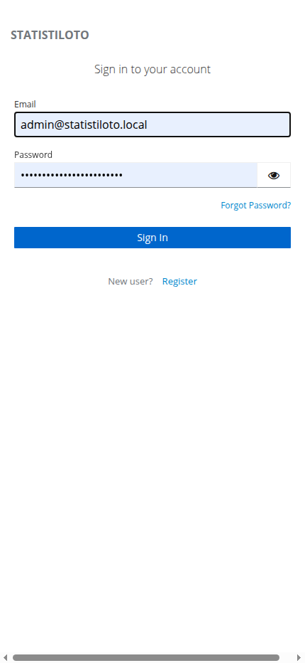

- Route: `/auth/realms/statistiloto/protocol/openid-connect/auth?...`
- Triggered by clicking "התחל עכשיו" on the home page.
- Keycloak renders its hosted login form (English UI by default).
- The admin email is pre-filled by the browser; password field is
  populated before clicking "Sign In".
- On success, Keycloak redirects back to `http://localhost/` with an
  authorization code, which the Angular client exchanges for tokens.

### 3. Home — Authenticated

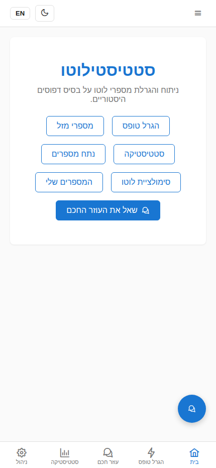

- Route: `/` (post-login)
- The hero CTAs are replaced with feature links: Generate, Lucky
  Numbers, Statistics, Analyze, Simulate, Saved Numbers, and "Ask the AI
  Assistant".
- The bottom-tab bar now appears (mobile): Home, Generate, Assistant,
  Statistics, Admin (admin role replaces the Saved tab for admins).
- The floating AI-assistant button is visible at the bottom-right.

### 4. Generate — Forms Produced

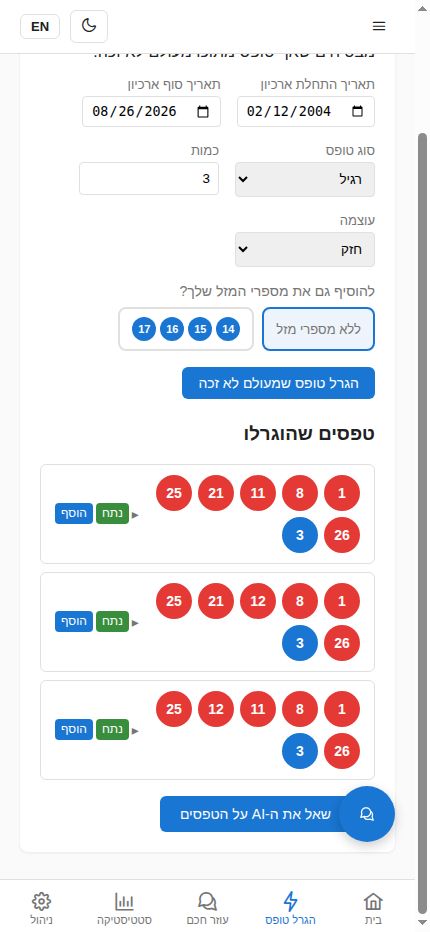

- Route: `/generate` (auth-guarded)
- Form controls: archive date range, form type (רגיל / 7–12), quantity
  (set to 3), strength (חזק / חלש), and an optional lucky-numbers
  toggle.
- After clicking "הגרל טופס שמעולם לא זכה", three generated forms
  appear under "טפסים שהוגרלו", each with the numbers
  (1, 8, 11, 21, 25, 26, 3) and per-form "נתח" (analyze) and "הוסף"
  (save) actions.
- A trailing "שאל את ה-AI על הטפסים" button routes the generated set
  to the assistant.

### 5. Lucky Numbers — Balls Picked


- Route: `/lucky` (auth-guarded)
- A 37-ball picker grid (1–37); up to 8 may be selected.
- Screenshot shows three balls selected (5, 10, 20) plus one previously
  saved set (14, 15, 16, 17) listed below with "נתח" / "מחק" actions.
- The "שמור את מספרי המזל" button is disabled until at least one ball
  is picked.

### 6. Statistics — Frequent Groups


- Route: `/statistics` (auth-guarded)
- Controls: archive date range, group size (1–6, default 2), quantity
  (default 10), strength.
- After clicking "חשב", the most-frequent number groups are rendered
  as a list under the form, each showing the group's numbers and its
  historical frequency ratio.

### 7. Analyze — Balls Picked

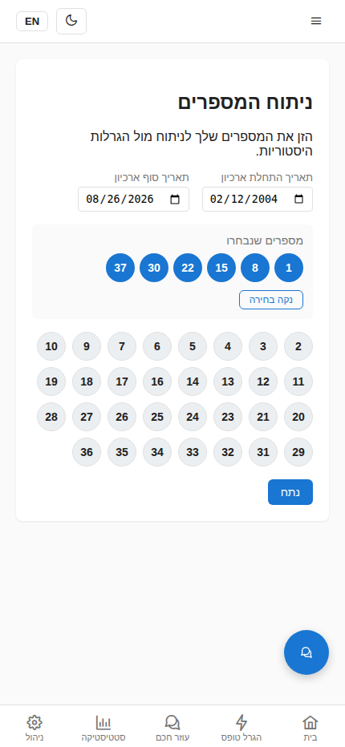

- Route: `/analyze` (auth-guarded)
- A 37-ball picker; the analyze button is disabled until 6 balls are
  selected.
- Screenshot shows the "מספרים שנבחרו" tray with six balls
  (1, 8, 15, 22, 30, 37) and a "נקה בחירה" (clear) button.
- The remaining unselected balls are still tappable; selected ones are
  removed from the grid.

### 8. Analyze — Frequency Results

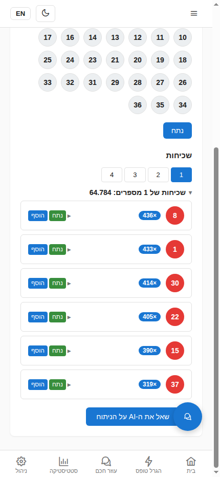

- Route: `/analyze` (after clicking "נתח")
- The results section renders frequency groups with ratio titles
  (e.g. "שכיחות של N מספרים: 0.000"), tabbed by match count.
- Each group is collapsible; entries list the matching historical draws.
- A "save" action persists the selected entry to the Saved Numbers page.

### 9. Simulate — Loaded

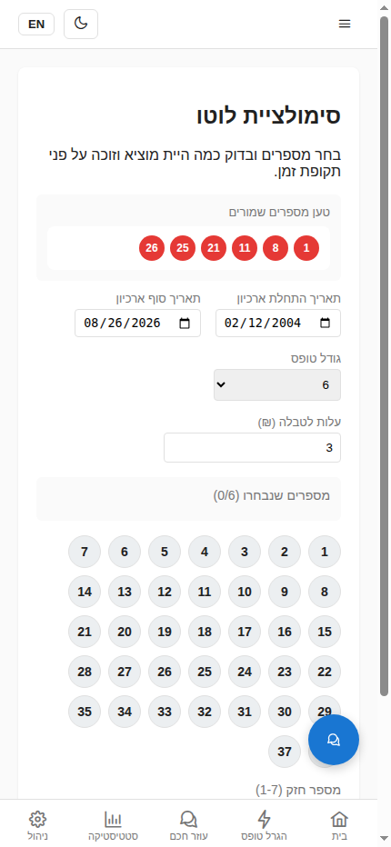

- Route: `/simulate` (auth-guarded)
- The simulation page on first load, before any numbers are picked or
  simulation run.
- Controls visible: a "טען מספרים שמורים" (load saved numbers) tray
  listing previously saved sets, archive date range, form size
  (6 / 8 / 10 / 12), ticket cost (₪), a 37-ball picker (empty —
  "מספרים שנבחרו (0/6)"), a strong-number picker (1–7), and a
  collapsible "הגדרת סכומי פרסים" (prize amounts) panel.
- The "הרץ סימולציה" button is disabled until enough numbers are
  selected.

### 10. Simulate — Results

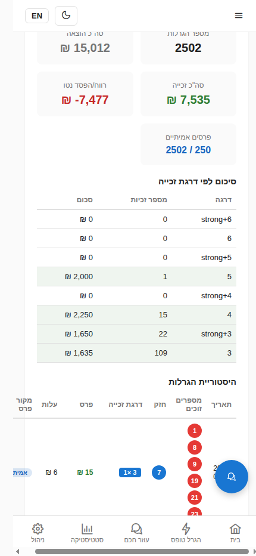

- Route: `/simulate` (after clicking "הרץ סימולציה")
- Backtest a chosen ticket against every historical draw in the archive
  window to see lifetime spend vs. winnings.
- The screenshot shows a saved set (1, 8, 11, 21, 25, 26) loaded with
  strong number 3, then "הרץ סימולציה" clicked. The "תוצאות סימולציה"
  section renders:
  - Summary cards: מספר הגרלות (total draws), סה"כ הוצאה (total spent),
    סה"כ זכייה (total won), רווח/הפסד נטו (net), and פרסים אמיתיים
    (draws priced with real historical prizes vs. estimates).
  - "סיכום לפי דרגת זכייה" tier table (6+strong down to 3) with hit
    counts and amounts.
  - "היסטוריית הגרלות" draw-by-draw table with winning numbers, strong
    number, tier hit, prize, cost, and a real/estimate prize-source badge.

### 11. Saved Numbers

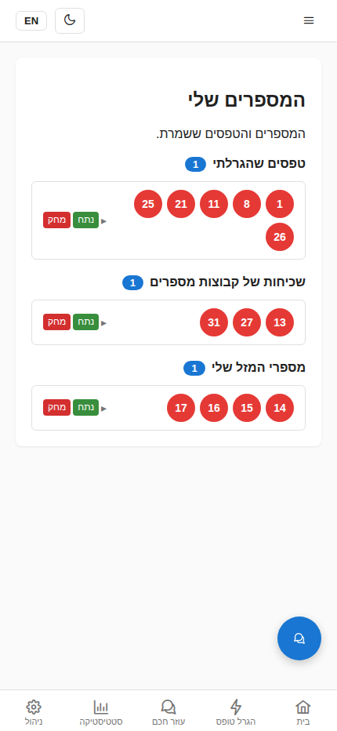

- Route: `/saved` (auth-guarded)
- Aggregates entries saved from Generate, Lucky, and Analyze, grouped
  by category: "טפסים שהגרלתי" (generated forms), "שכיחות של קבוצות
  מספרים" (frequency groups), and "מספרי המזל שלי" (lucky numbers).
- Each category heading shows a count badge. Each entry offers "נתח"
  (re-analyze via modal) and "מחק" (delete) actions, plus an expand
  toggle to inspect the numbers.

### 12. AI Assistant

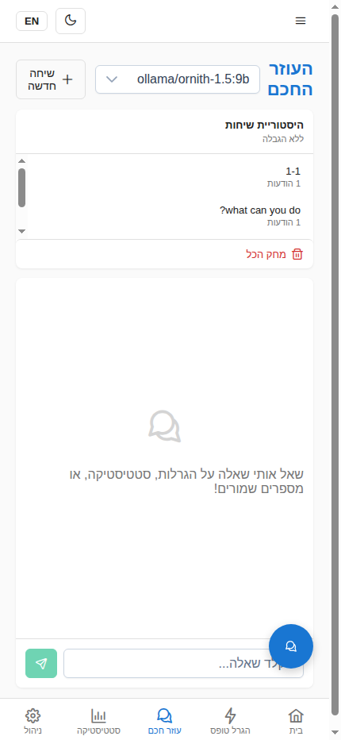

- Route: `/assistant` (auth-guarded)
- A chat interface to the Python LangGraph agent, which calls the Go
  lottery service via gRPC and the Java BFF via HTTP.
- The left sidebar shows **chat session history** — a list of past
  conversations with message counts and per-session delete buttons,
  plus a "מחק הכל" (Delete all) button. The tier's session limit is
  shown at the top ("ללא הגבלה" = unlimited for admin).
- The main panel shows a welcome message and the chat input.
- The agent can answer natural-language questions about generated
  forms, statistics, and saved numbers, with human-in-the-loop
  approval for sensitive actions.

### 13. Admin — LLM Configuration

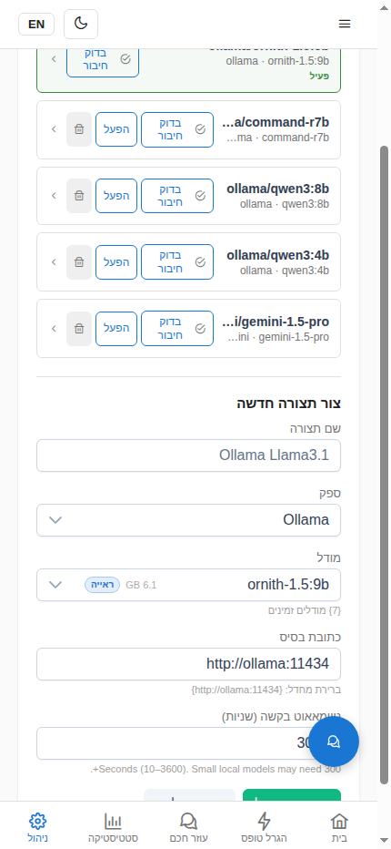

- Route: `/admin/llm-config` (ADMIN role only)
- **Stored configurations** section: lists all saved LLM configs
  (ollama, gemini, openai providers) with the active one marked
  "פעיל". Each config card header has aligned action buttons —
  "בדוק חיבור" (Test connection), "הפעל" (Activate), and a trash-icon
  delete — all rendered at the same height via flexbox with a fixed
  `min-height`. The "בדוק חיבור" button wraps to two lines to fit the
  narrow mobile width.
- The **Edit** button is inside the expandable card details — click a
  config card to expand it, then click "ערוך" to load that config into
  the edit form below.
- Edit the active LLM provider, model, base URL, API key, and
  timeout. Changes persist to the `agent.llm_config` table and
  hot-reload without restart.

### 14. Admin — Token Usage

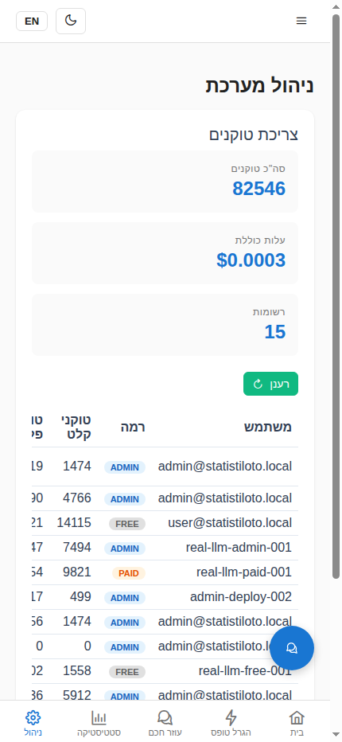

- Route: `/admin/token-usage` (ADMIN role only)
- Per-user token consumption table, sourced from the
  `agent.token_usage` table. Columns: User, Tier, Prompt tokens,
  Completion tokens, Cost, Model (model is last so the user/tier
  columns stay visible on narrow screens). The user column shows the
  Keycloak email (resolved via `keycloak.user_entity` join) rather
  than the opaque JWT `sub`. Useful for cost tracking and quota
  enforcement.

### 15. Admin — Audit Log

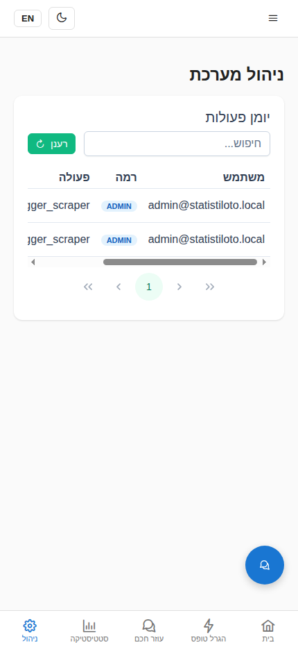

- Route: `/admin/audit-log` (ADMIN role only)
- Chronological list of agent actions (including HITL approvals,
  tool calls, and errors) from the `agent.audit_log` table. The user
  column shows the Keycloak email (resolved via `keycloak.user_entity`
  join) rather than the opaque JWT `sub`.

### 16. Admin — Scraper Control

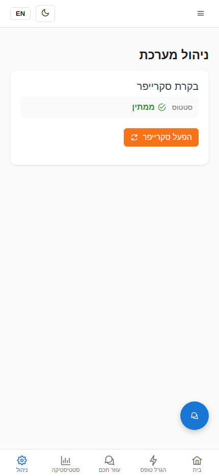

- Route: `/admin/scraper` (ADMIN role only)
- Manual control of the Israeli-lottery scraper: trigger an immediate
  run, view the last-run timestamp, and inspect the cron schedule
  (`LOTTERY_SCRAPER_CRON`, default `0 3 * * *`).

## Regenerating the Screenshots

The screenshots are produced by driving the Playwright MCP browser
against a running stack. Every PNG is exactly 430×932 (viewport-only,
`fullPage: false`, `scale: "device"`). To reproduce:

```bash
# 1. Start the stack
make up

# 2. Wait for all services to be healthy
make wait

# 3. Drive the Playwright MCP browser in this exact order:
#    a. browser_resize  -> width=430, height=932
#    b. browser_navigate -> http://localhost/
#    c. browser_take_screenshot -> 01-home-unauthenticated.png  (fullPage=false, scale=device)
#    d. click "התחל עכשיו" -> Keycloak login page
#    e. browser_take_screenshot -> 02-keycloak-login.png
#    f. click "Sign In" -> redirect back to /
#    g. browser_take_screenshot -> 03-home-authenticated.png
#
#    For each feature page below:
#      - browser_navigate to the route
#      - interact (pick balls / set quantity / click compute) to produce visible data
#      - browser_evaluate to scroll the results heading into view:
#          document.querySelector('h3').scrollIntoView({block:'start'})
#        (or scroll to top for pages that fit)
#      - browser_take_screenshot with fullPage=false, scale=device
#
#    Routes in order:
#      /generate   -> set quantity=3, click "הגרל", scroll to "טפסים שהוגרלו" -> 04
#      /lucky      -> pick balls 5,10,20, scroll to top                          -> 05
#      /statistics -> click "חשב", scroll to "קבוצות תכופות"                   -> 06
#      /analyze    -> pick balls 1,8,15,22,30,37, scroll to "מספרים שנבחרו"     -> 07
#                     click "נתח", scroll to "שכיחות"                           -> 08
#      /simulate   -> scroll to top (page on first load)                        -> 09
#                     click a saved set, pick strong=3, click "הרץ סימולציה",
#                     scroll to "תוצאות סימולציה"                                -> 10
#      /saved      -> scroll to top                                            -> 11
#      /assistant  -> scroll to top                                            -> 12
#      /admin/llm-config  -> scroll to "תצורות שמורות" (h4)                   -> 13
#      /admin/token-usage -> scroll to top                                     -> 14
#      /admin/audit-log   -> scroll to top                                     -> 15
#      /admin/scraper     -> scroll to top                                     -> 16
#
# 4. Copy the PNGs from the Playwright output dir into docs/screenshots/
```

Files are named `NN-page-description.png` (zero-padded) so they sort
in journey order. The Markdown above references each file by relative
path, so it renders correctly on GitHub and in local markdown previewers.
