# Statistiloto-New — UI Screenshot Tour

Automated screenshots of every page in the Statistiloto-New PWA, captured
through the Playwright MCP browser against a live Docker Compose stack.

## Capture Setup

| Setting | Value |
|---------|-------|
| Tool | Playwright MCP (`browser_take_screenshot`, full-page, device scale) |
| Viewport | **430 × 932** (iPhone 16 Pro Max) |
| Theme | Light (default) |
| Language | Hebrew (default, RTL) |
| Auth | `admin@statistiloto.local` (USER + ADMIN roles) |
| Stack | `docker compose up -d` on `http://localhost` |
| Date | 2026-08-24 |

> The mobile viewport surfaces the bottom-tab navigation bar and the
> hamburger menu — the desktop sidebar is hidden at this width, which is
> the intended responsive behavior.

## Screenshot Flow

The screenshots follow a realistic first-run user journey: land on the
home page unauthenticated → log in via Keycloak → exercise each feature
page to generate visible data → finish with the admin section.

### 1. Home — Unauthenticated

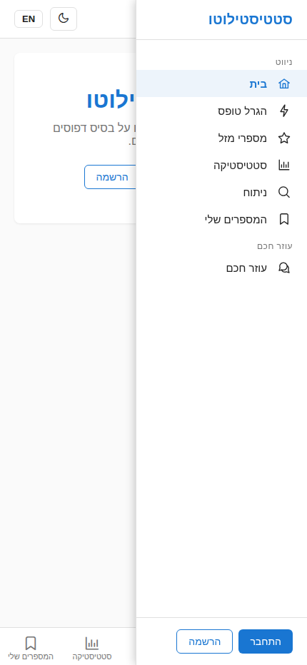

- Route: `/`
- The landing page shows the app title, tagline, and two CTAs
  ("התחבר" / login, "הרשמה" / register).
- The sidebar (hidden on mobile) is replaced by bottom tabs once
  authenticated; here only the header and hero are visible.
- No data has been generated yet.

### 2. Keycloak Login

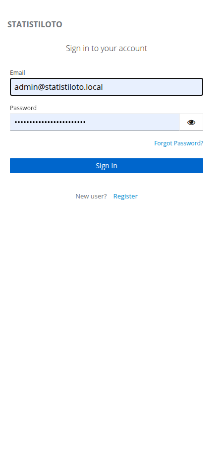

- Route: `/auth/realms/statistiloto/protocol/openid-connect/auth?...`
- Triggered by clicking "התחבר" on the home page.
- Keycloak renders its hosted login form (English UI by default).
- The admin email is pre-filled by the browser; password field is
  populated before clicking "Sign In".
- On success, Keycloak redirects back to `http://localhost/` with an
  authorization code, which the Angular client exchanges for tokens.

### 3. Home — Authenticated

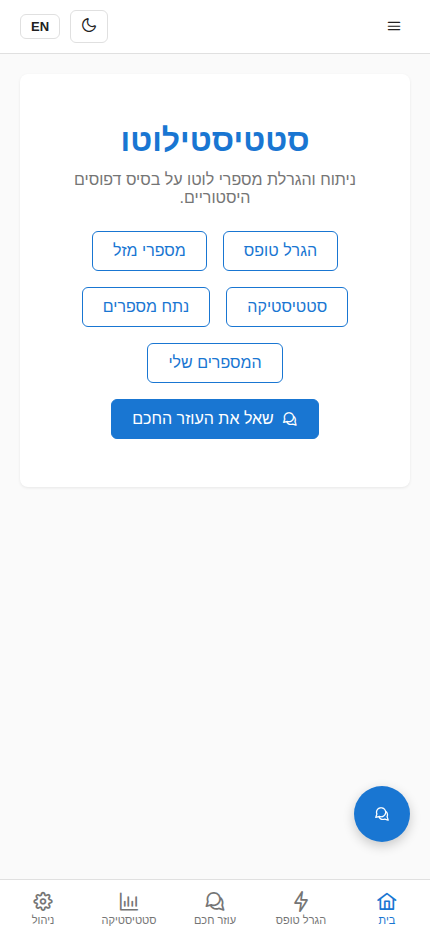

- Route: `/` (post-login)
- The hero CTAs are replaced with feature links: Generate, Lucky
  Numbers, Statistics, Analyze, Saved Numbers, and "Ask the AI
  Assistant".
- The bottom-tab bar now appears (mobile): Home, Generate, Assistant,
  Statistics, Admin.
- The floating AI-assistant button is visible at the bottom-right.

### 4. Generate — Forms Produced

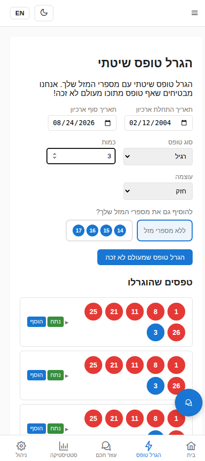

- Route: `/generate` (auth-guarded)
- Form controls: archive date range, form type (רגיל / 7–12), quantity
  (set to 3), strength (חזק / חלש), and an optional lucky-numbers
  toggle.
- After clicking "הגרל טופס שמעולם לא זכה", three generated forms
  appear under "טפסים שהוגרלו", each with the numbers
  (1, 8, 11, 21, 25, 26, 3) and per-form "נתח" (analyze) and "הוסף"
  (save) actions.
- A trailing "שאל את ה-AI על הטפסים" button routes the generated set
  to the assistant.

### 5. Lucky Numbers — Balls Picked

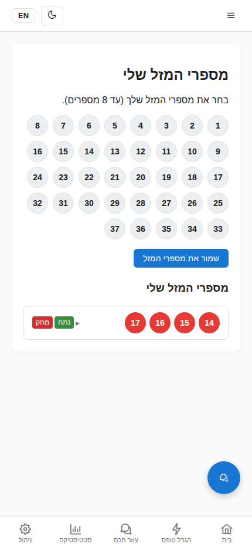

- Route: `/lucky` (auth-guarded)
- A 37-ball picker grid (1–37); up to 8 may be selected.
- Screenshot shows three balls selected (5, 10, 20) plus one previously
  saved set (14, 15, 16, 17) listed below with "נתח" / "מחק" actions.
- The "שמור את מספרי המזל" button is disabled until at least one ball
  is picked.

### 6. Statistics — Frequent Groups

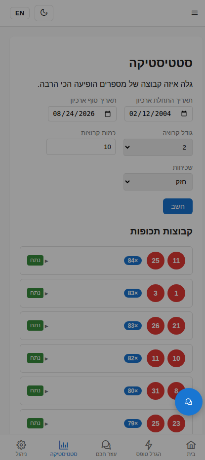

- Route: `/statistics` (auth-guarded)
- Controls: archive date range, group size (1–6, default 2), quantity
  (default 10), strength.
- After clicking "חשב", the most-frequent number groups are rendered
  as a list under the form, each showing the group's numbers and its
  historical frequency ratio.

### 7. Analyze — Balls Picked


- Route: `/analyze` (auth-guarded)
- A 37-ball picker; the analyze button is disabled until 6 balls are
  selected.
- Screenshot shows the "מספרים שנבחרו" tray with six balls
  (1, 8, 15, 22, 30, 37) and a "נקה בחירה" (clear) button.
- The remaining unselected balls are still tappable; selected ones are
  removed from the grid.

### 8. Analyze — Frequency Results

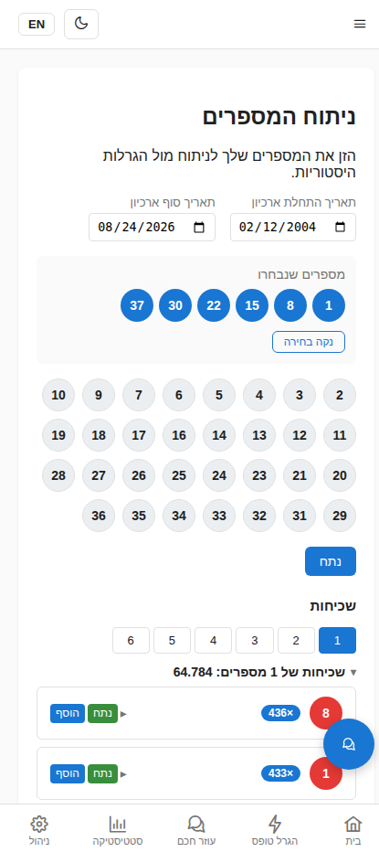

- Route: `/analyze` (after clicking "נתח")
- The results section renders frequency groups with ratio titles
  (e.g. "שכיחות של N מספרים: 0.000"), tabbed by match count.
- Each group is collapsible; entries list the matching historical draws.
- A "save" action persists the selected entry to the Saved Numbers page.

### 9. Saved Numbers


- Route: `/saved` (auth-guarded)
- Aggregates entries saved from Generate, Lucky, and Analyze.
- Each entry is grouped by category and offers "נתח" (re-analyze via
  modal) and expand/collapse to inspect the numbers.
- Infinite-scroll pagination loads more entries as the user scrolls.

### 10. AI Assistant

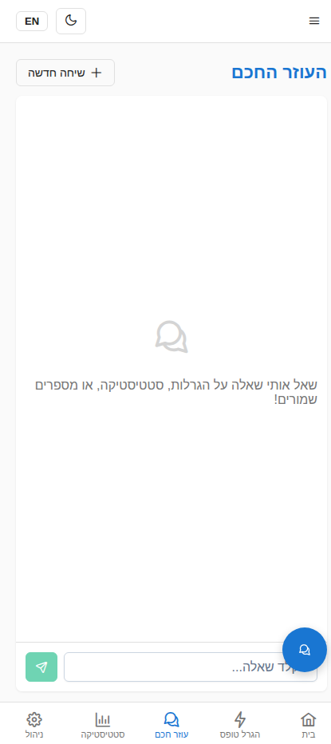

- Route: `/assistant` (auth-guarded)
- A chat interface to the Python LangGraph agent, which calls the Go
  lottery service via gRPC and the Java BFF via HTTP.
- The agent can answer natural-language questions about generated
  forms, statistics, and saved numbers, with human-in-the-loop
  approval for sensitive actions.

### 11. Admin — LLM Configuration

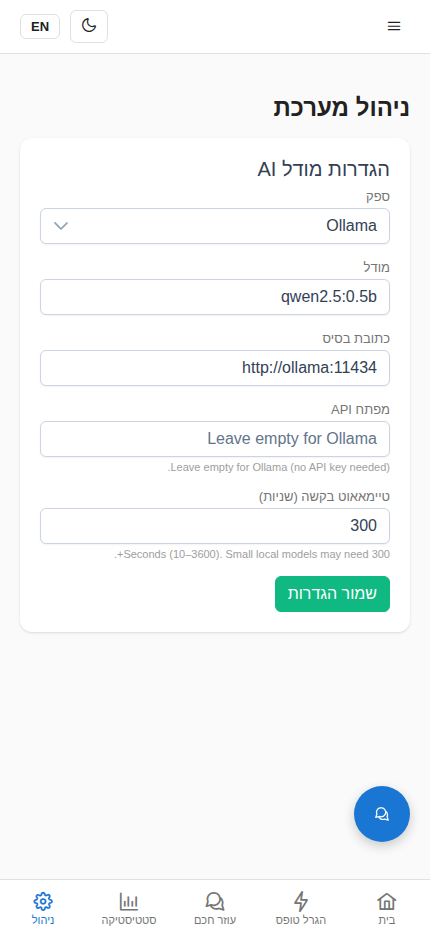

- Route: `/admin/llm-config` (ADMIN role only)
- Edit the active LLM provider, model, temperature, and token limits
  used by the agent. Changes persist to the `agent.llm_config` table.

### 12. Admin — Token Usage

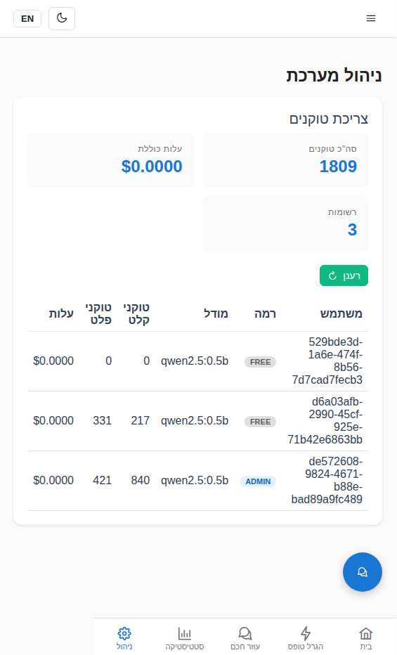

- Route: `/admin/token-usage` (ADMIN role only)
- Per-user token consumption broken down by model and day, sourced
  from the `agent.token_usage` table. Useful for cost tracking and
  quota enforcement.

### 13. Admin — Audit Log

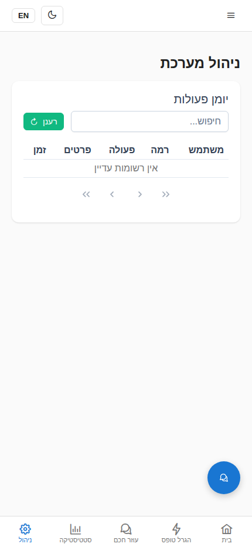

- Route: `/admin/audit-log` (ADMIN role only)
- Chronological list of agent actions (including HITL approvals,
  tool calls, and errors) from the `agent.audit_log` table.

### 14. Admin — Scraper Control


- Route: `/admin/scraper` (ADMIN role only)
- Manual control of the Israeli-lottery scraper: trigger an immediate
  run, view the last-run timestamp, and inspect the cron schedule
  (`LOTTERY_SCRAPER_CRON`, default `0 3 * * *`).

## Regenerating the Screenshots

The screenshots are produced by driving the Playwright MCP browser
against a running stack. To reproduce:

```bash
# 1. Start the stack (dev profile)
make up-dev

# 2. Wait for all services to be healthy
make wait

# 3. Drive the Playwright MCP browser:
#    - resize to 430 x 932
#    - navigate to http://localhost/
#    - log in as admin@statistiloto.local / admin-password-change-me
#    - visit each route and capture a full-page device-scale PNG
#    - save into docs/screenshots/
```

Files are named `NN-page-description.png` (zero-padded) so they sort
in journey order. The Markdown above references each file by relative
path, so it renders correctly on GitHub and in local markdown previewers.
