# Statistiloto — ui-fable Screenshot Tour

Automated screenshots of every page in the redesigned **ui-fable** PWA (the
AI lottery coach), captured through a Playwright test against a live Docker
Compose stack. This is the redesigned UI; the original UI's screenshots live
in [`../old-screenshots/`](../old-screenshots/).

## Capture Setup

| Setting | Value |
|---------|-------|
| Tool | Playwright test (`ui-fable/e2e/screenshots.spec.ts`) |
| Viewport | **430 × 932** (iPhone 16 Pro Max) — fixed, every PNG is exactly this size |
| Capture mode | `fullPage: false` — only the visible viewport, so the top bar + bottom nav are always visible |
| Scroll strategy | Lab tab buttons scrolled into view first, then the results section; pages with modals scroll the modal content into view |
| Theme | Light (default) |
| Language | Hebrew (default, RTL) |
| Auth | `admin@statistiloto.local` (USER + ADMIN roles) |
| Stack | `docker compose up -d` on `http://localhost` (no ngrok override) |
| Date | 2026-09-06 |

> All 18 PNGs are exactly 430×932 pixels. The mobile viewport surfaces the
> bottom-tab navigation bar and the agent-rail FAB — the desktop right rail
> is hidden at this width, which is the intended responsive behavior. Pages
> taller than the viewport are scrolled to the relevant section before
> capture so the screenshot shows the feature in context, not the form.

## Screenshot Flow

The screenshots follow a realistic first-run user journey through the
redesigned IA: land on the guest demo → log in via Keycloak → arrive at the
Coach Workspace → run the Daily Briefing guided flow → exercise each Lab tab
to generate visible data → open the Analyze modal from Statistics (recursion
on a frequency group) → check the Number Wallet → ask the Agent Rail to
generate numbers (free chat with pretty ball rendering) → finish with the
admin section.

### 1. Landing — Guest Demo (unauthenticated)

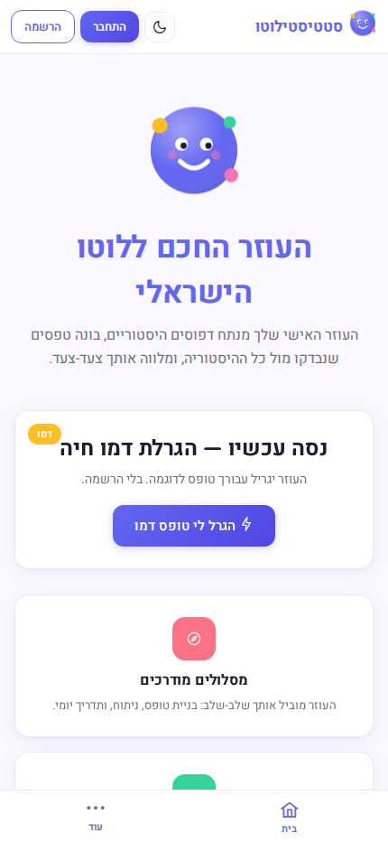

- Route: `/`
- *Old: `01-home-unauthenticated.png`*
- The logged-out landing shows the coach avatar, hero title, and a
  sandboxed demo card with a "try one draw" button (one demo per visit).
- Below the demo: feature highlights (guided flows, Lab, backtest) and
  the auth CTAs ("התחבר" / login, "הרשמה" / register).
- The top bar shows brand + login/register buttons (no nav links yet).

### 2. Keycloak Login


- Route: `/auth/realms/statistiloto/protocol/openid-connect/auth?...`
- *Old: `02-keycloak-login.png`*
- Triggered by clicking the login CTA on the guest demo page.
- Keycloak renders its hosted login form. The admin email and password
  are populated before the screenshot is taken (before clicking "Sign In").

### 3. Coach Workspace — Authenticated Landing

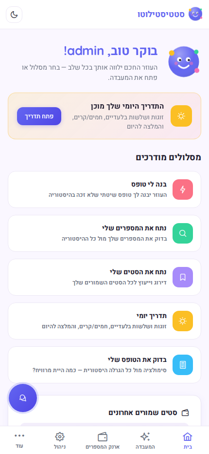

- Route: `/` (post-login)
- *Old: `03-home-authenticated.png`*
- The guest demo is replaced by the **Coach Workspace**: a personal
  greeting (time-of-day aware), a daily-briefing teaser, suggested flow
  cards (Build Form, Analyze, Backtest, Daily Briefing, Coach Saved), and
  a recent-saved-sets panel + Lab CTA at the bottom.
- The top bar now shows nav links (Home, Lab, Wallet, Admin) + tier badge
  + theme/lang toggles + profile + logout.
- The bottom-tab bar appears on mobile: Home, Lab, Wallet, Admin, More.
- The floating agent-rail FAB (💬) is visible at the bottom-right.

### 4. Daily Briefing Flow (guided)

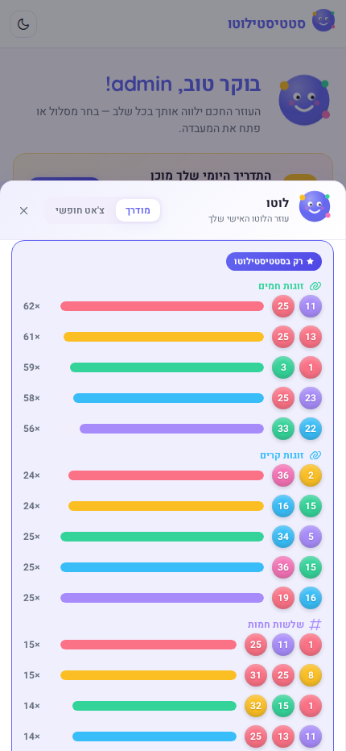

- Route: `/` → click briefing teaser → agent rail opens in guided mode
- *New screenshot — no old equivalent*
- The Daily Briefing is a guided flow that loads hot/cold singles, pairs,
  and triples statistics and presents them as a narrated briefing.
- The screenshot shows step 2 (results): the coach narration, an
  "exclusive insight" panel with pairs/triples frequency bars (only
  Statistiloto computes these), hot/cold number clouds, and a
  recommended-action card with buttons to launch the Backtest or
  Build-Form flow.
- The flow runs inside the agent rail (mobile bottom sheet).

### 5. Lab — Generate Tab (with results)

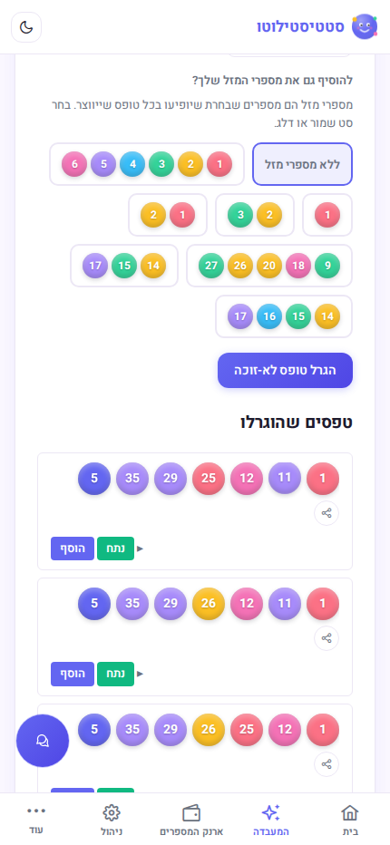

- Route: `/lab?tab=generate` (auth-guarded)
- *Old: `04-generate-with-forms.png`*
- The unified Lab header + 5 tab buttons (Generate, Lucky, Statistics,
  Analyze, Simulate). The Generate tab is active and scrolled into view.
- Form controls: archive window, form type, quantity (set to 3), strength.
- After clicking generate, three generated forms appear under the results
  heading, each with numbers + strong ball, and per-form analyze/save/share
  actions. A trailing "ask the AI" button routes the set to the agent rail.

### 6. Lab — Lucky Tab (balls picked)

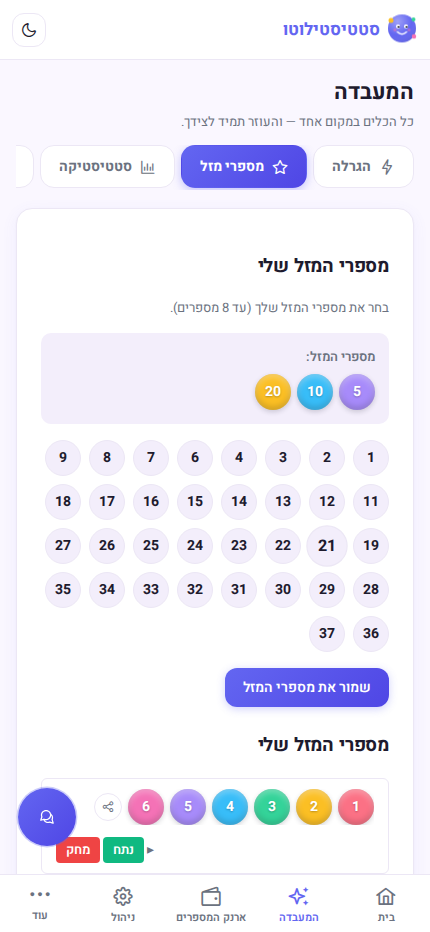

- Route: `/lab?tab=lucky` (auth-guarded)
- *Old: `05-lucky-numbers-picked.png`*
- A 37-ball picker grid (1–37); up to 8 may be selected.
- Screenshot shows three balls selected (5, 10, 20) in the "מספרים שנבחרו"
  tray. The Lucky tab button is visible at the top.

### 7. Lab — Statistics Tab (with results)

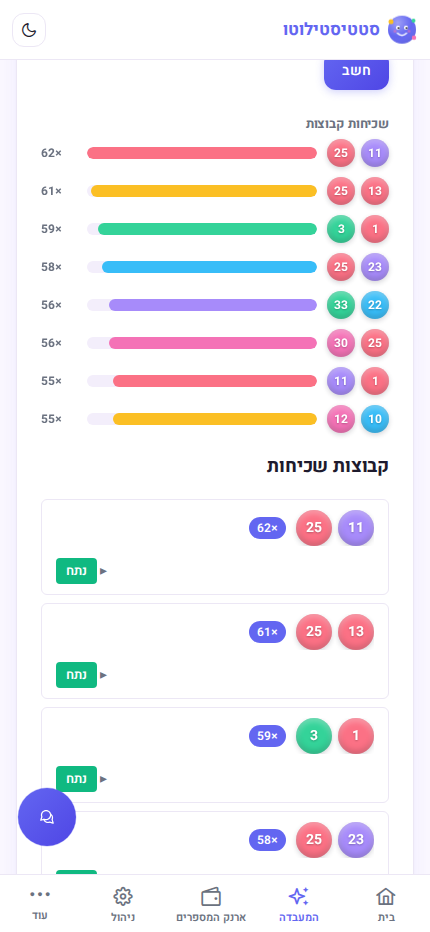

- Route: `/lab?tab=statistics` (auth-guarded)
- *Old: `06-statistics-with-results.png`*
- Controls: archive summary, group size (1–6, default 2), quantity
  (default 10), strength.
- After clicking compute, results render as a hot/cold cloud (for
  single-number groups) or animated frequency bars (for multi-number
  groups), followed by the most-frequent number groups list. The
  Statistics tab button is visible at the top.

### 8. Statistics — Analyze Modal (recursion on a group)

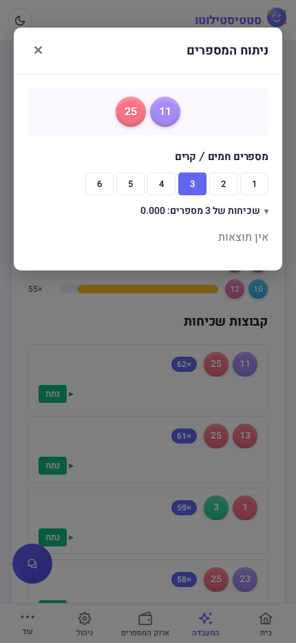

- Route: `/lab?tab=statistics` → click "analyze" on a frequency group entry
- *New screenshot — shows the final user action result*
- Clicking the "analyze" action button on a frequency group entry in the
  Statistics results opens the **Analyze Modal** — the recursion component
  that re-analyzes the selected numbers and shows hot/cold sub-groups
  tabbed by match size (1–6).
- The screenshot shows the modal with the "3" tab active, displaying the
  3-number frequency groups split into hot (top half) and cold (bottom
  half) sections. Each entry can be further analyzed (recursion) or saved
  to the Number Wallet.
- This demonstrates the final component user action: the analyze button
  triggers the modal which loads the frequency analysis.

### 9. Lab — Analyze Tab (balls picked)

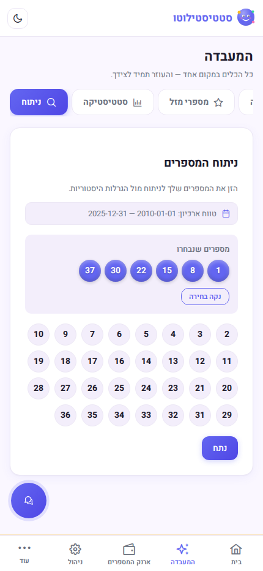

- Route: `/lab?tab=analyze` (auth-guarded)
- *Old: `07-analyze-balls-picked.png`*
- A 37-ball picker; the analyze button is enabled once at least one ball
  is selected.
- Screenshot shows the "מספרים שנבחרו" tray with six balls
  (1, 8, 15, 22, 30, 37) and a "נקה בחירה" (clear) button. The Analyze
  tab button is visible at the top.

### 10. Lab — Analyze Tab (frequency results)

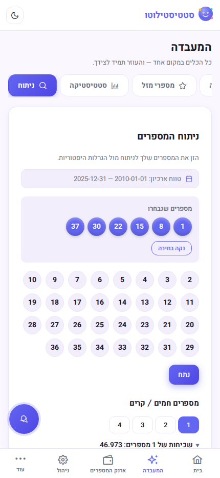

- Route: `/lab?tab=analyze` (after clicking "נתח")
- *Old: `08-analyze-with-results.png`*
- The results section renders frequency groups, tabbed by match count.
  Each group is collapsible; entries list the matching historical draws.

### 11. Lab — Simulate Tab (loaded)

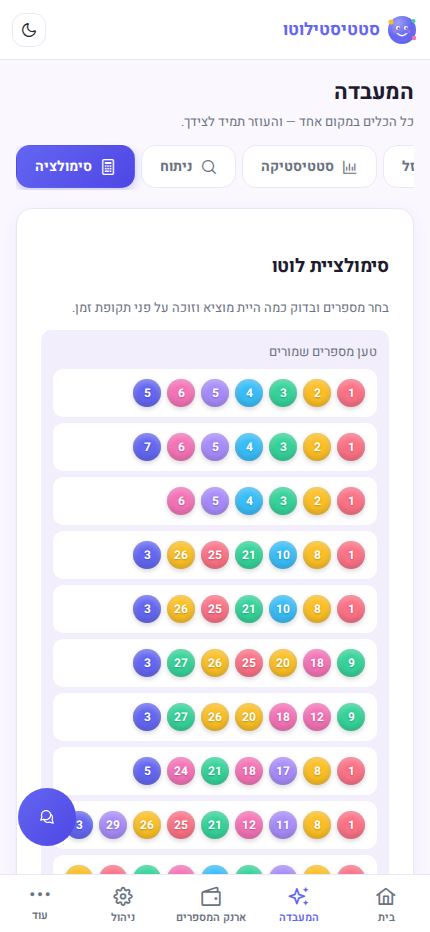

- Route: `/lab?tab=simulate` (auth-guarded)
- *Old: `09-simulate-loaded.png`*
- The simulate tab on first load, before any numbers are picked or
  simulation run. The Simulate tab button is visible at the top.
- Controls visible: a "load saved numbers" tray, archive summary,
  backtest date range (defaults to the last month), form size
  (6 / 8 / 10 / 12), ticket cost (₪), a 37-ball picker (empty), a
  strong-number picker (1–7), and a collapsible prize-amounts panel.

### 12. Lab — Simulate Tab (with results)

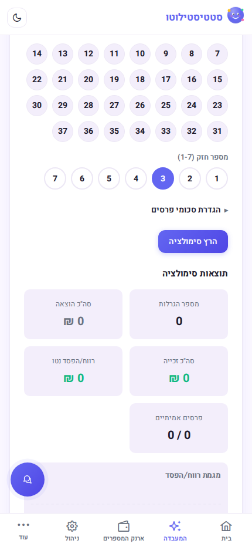

- Route: `/lab?tab=simulate` (after clicking "הרץ סימולציה")
- *Old: `10-simulate-with-results.png`*
- Backtest a chosen ticket against every historical draw in the backtest
  window to see lifetime spend vs. winnings.
- 6 regular numbers + strong number 3 are picked, then "הרץ סימולציה"
  clicked. The results section renders:
  - Summary cards: total draws, total spent, total won, net P&L, and
    real-prizes count.
  - Net-trend sparkline + per-tier hit heatmap (new visualizations).
  - Tier summary table (6+strong down to 3) with hit counts and amounts.
  - Draw-by-draw history table with winning numbers, strong number, tier
    hit, prize, cost, and a real/estimate prize-source badge.

### 13. Number Wallet

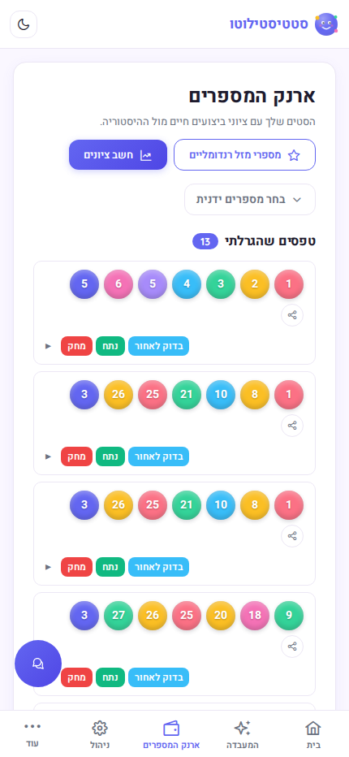

- Route: `/saved` (auth-guarded)
- *Old: `11-saved-numbers.png`*
- The enhanced saved-numbers page: categorized sets (generated forms,
  frequency groups, lucky numbers) with live performance-score badges
  (computed against history via the analyze API).
- A manual ball picker (collapsible) and an "add random lucky" button.
- Each entry offers analyze (re-analyze via modal), delete, share, and a
  one-click backtest launch into the Simulate flow.

### 14. Agent Rail — Free Chat: Generate Numbers → Balls Render

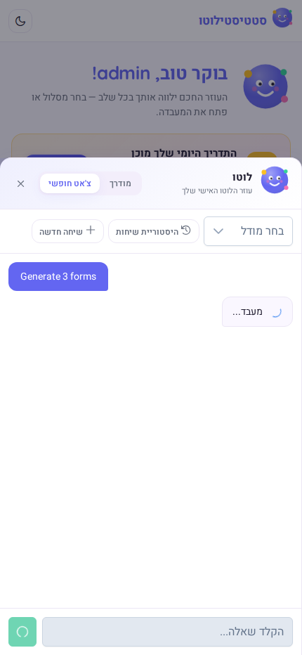

- Route: `/` → open rail FAB → switch to free mode → send "Generate 3 forms"
- *Old: `12-assistant.png`*
- The old standalone Assistant page is replaced by the persistent
  **Agent Rail** (desktop: right sidebar; mobile: bottom sheet opened via
  the 💬 FAB).
- This screenshot shows the **final user action result**: the user asks
  "Generate 3 forms" in free chat, the agent calls the Go lottery service
  via gRPC, and the response is rendered with **pretty ball components** —
  the agent-chat component parses the response text, detects lottery
  number lines, and renders them as colored `app-lottery-ball` elements
  (regular balls + strong ball) inline with the text.
- The user message bubble (indigo) and the assistant response with ball
  groups are both visible.

### 15. Admin — LLM Configuration

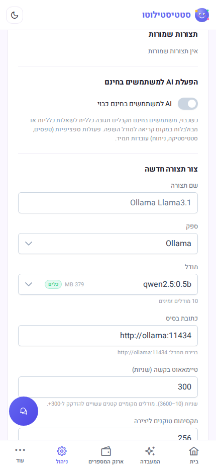

- Route: `/admin/llm-config` (ADMIN role only)
- *Old: `13-admin-llm-config.png`*
- Stored configurations section: lists all saved LLM configs with the
  active one marked. Each config card has test-connection, activate, and
  delete actions.

### 16. Admin — Token Usage

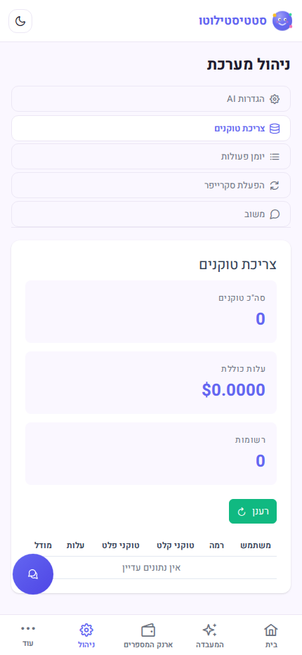

- Route: `/admin/token-usage` (ADMIN role only)
- *Old: `14-admin-token-usage.png`*
- Per-user token consumption table, sourced from the
  `agent.token_usage` table. Columns: User, Tier, Prompt tokens,
  Completion tokens, Cost, Model.

### 17. Admin — Audit Log

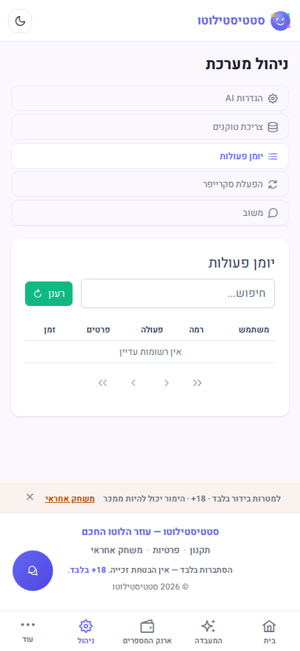

- Route: `/admin/audit-log` (ADMIN role only)
- *Old: `15-admin-audit-log.png`*
- Chronological list of agent actions (including HITL approvals, tool
  calls, and errors) from the `agent.audit_log` table.

### 18. Admin — Scraper Control

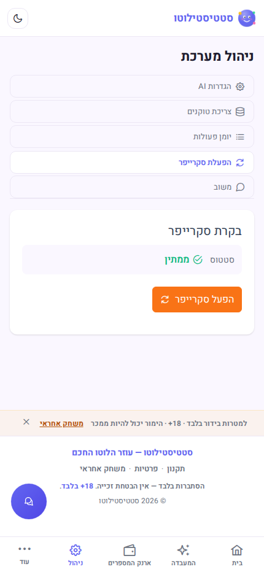

- Route: `/admin/scraper` (ADMIN role only)
- *Old: `16-admin-scraper.png`*
- Manual control of the Israeli-lottery scraper: trigger an immediate
  run, view the last-run timestamp, and inspect the cron schedule.

## Regenerating the Screenshots

Unlike the old tour (which was driven manually through the Playwright MCP
browser), this tour is **fully automated** as a Playwright test. Every PNG
is exactly 430×932 (viewport-only, `fullPage: false`, `scale: "device"`).

```bash
# 1. Start the stack (ui-fable is served via Traefik on :80)
#    IMPORTANT: do NOT use the ngrok override — the agent chat needs
#    issuer validation disabled (default) to call the Go lottery service.
make up

# 2. Wait for all services to be healthy
make wait

# 3. Regenerate all 18 screenshots:
make screenshots
#    — or equivalently —
cd ui-fable && npx playwright test screenshots --reporter=list
```

The test (`ui-fable/e2e/screenshots.spec.ts`) logs in as
`admin@statistiloto.local`, drives the full journey in order, and writes
PNGs directly into `docs/screenshots/`. It uses soft waits (never fails
if a results section is empty due to a fresh DB) and scrolls the relevant
section into view before each capture.

### What the test does (in order)

1. `page.setViewportSize(430 × 932)`
2. Navigate to `/` → screenshot **01** (guest demo, unauthenticated)
3. Click login CTA → fill Keycloak form → screenshot **02** (login form)
4. Submit → redirect to `/` → screenshot **03** (coach workspace)
5. Click briefing teaser → wait for flow results → screenshot **04** (daily briefing)
6. `/lab?tab=generate` → set quantity=3, click generate, scroll tab + results → **05**
7. `/lab?tab=lucky` → pick balls 5/10/20, scroll tab + selected → **06**
8. `/lab?tab=statistics` → click compute, scroll tab + results → **07**
9. Click "analyze" on a statistics result → wait for modal, click "3" tab → **08**
10. `/lab?tab=analyze` → pick balls 1/8/15/22/30/37, scroll tab + selected → **09**
11. Click analyze, scroll tab + results → **10**
12. `/lab?tab=simulate` → scroll tab + top (first load) → **11**
13. Pick 6 balls + strong=3, click run, scroll tab + results → **12**
14. `/saved` → scroll to wallet head → **13**
15. `/` → open rail FAB → free mode → send "Generate 3 forms" → wait for
    assistant response with ball-group rendering → **14**
16. `/admin/llm-config` → **15**
17. `/admin/token-usage` → **16**
18. `/admin/audit-log` → **17**
19. `/admin/scraper` → **18**

Files are named `NN-page-description.png` (zero-padded) so they sort in
journey order. The Markdown above references each file by relative path,
so it renders correctly on GitHub and in local markdown previewers.

### Old → New mapping

| Old (`old-screenshots/`) | New (`screenshots/`) | Notes |
|--------------------------|----------------------|-------|
| `01-home-unauthenticated` | `01-landing-guest` | Guest demo replaces static hero |
| `02-keycloak-login` | `02-keycloak-login` | Same |
| `03-home-authenticated` | `03-coach-workspace` | Coach workspace with flow cards |
| — | `04-daily-briefing` | **New**: guided briefing flow |
| `04-generate-with-forms` | `05-lab-generate-results` | Now a Lab tab |
| `05-lucky-numbers-picked` | `06-lab-lucky-picked` | Now a Lab tab |
| `06-statistics-with-results` | `07-lab-statistics-results` | Now a Lab tab |
| — | `08-statistics-analyze-modal` | **New**: analyze modal recursion |
| `07-analyze-balls-picked` | `09-lab-analyze-picked` | Now a Lab tab |
| `08-analyze-with-results` | `10-lab-analyze-results` | Now a Lab tab |
| `09-simulate-loaded` | `11-lab-simulate-loaded` | Now a Lab tab |
| `10-simulate-with-results` | `12-lab-simulate-results` | Now a Lab tab |
| `11-saved-numbers` | `13-number-wallet` | Enhanced with performance badges |
| `12-assistant` | `14-agent-chat-generate-balls` | Rail + chat with ball rendering |
| `13-admin-llm-config` | `15-admin-llm-config` | Same |
| `14-admin-token-usage` | `16-admin-token-usage` | Same |
| `15-admin-audit-log` | `17-admin-audit-log` | Same |
| `16-admin-scraper` | `18-admin-scraper` | Same |
